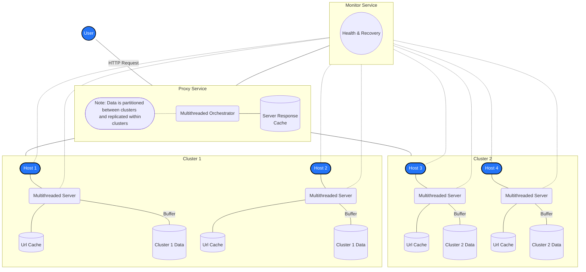
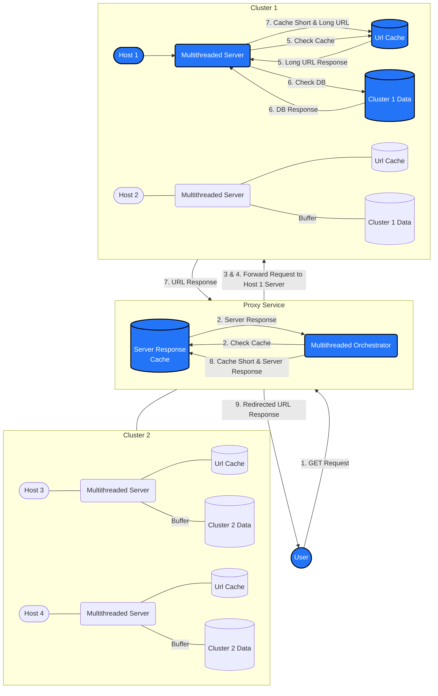
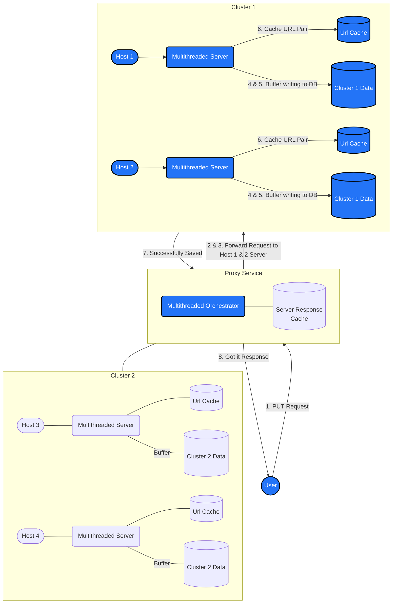

# CSC409 A1 - URL Shortener

> A lightweight scalable URL Shortener system



The following mermaid diagram architecturally describes the system, view in a markdown viewer that supports mermaid diagrams such as GitHub.

## Table of Contents

- [Architecture](#architecture)
  - [System Overview](#system-overview)
    - [GET Data Flow](#get-data-flow)
    - [PUT Data Flow](#put-data-flow)
  - [Code Overview](#code-overview)
- [Running The System](#running-the-system)
  - [Initial Setup](#initial-setup)
  - [Configuration](#configuration)
  - [Usage](#usage)
  - [Scaling Up](#scaling-up)
  - [Scaling Down](#scaling-down)
- [Testing The System](#testing-the-system)
- [Analysis](#analysis)

## Architecture

### System Overview

The system structure is composed of the following components:

- **Proxy**: The proxy service is responsible for receiving HTTP requests from the user and forwarding them to the appropriate server. It will load balance the requests between the servers with the orchestrator. It will also cache the responses from the servers to reduce the load on the servers.

- **Orchestrator**: The orchestrator is responsible for managing the groupings of hosts to clusters, along with the load balancing of the requests between the clusters and servers. The strategy used for load balancing is consistent hashing, so the hashing will stay consistent if scale up in clusters.

- **Cluster**: The cluster is an abstraction of a group of hosts and servers. Data is partitioned between the clusters and replicated within the clusters. This way, if a host or server fails, the data will still be available on another host within the cluster.

- **Host**: The host is responsible for running the server and storing the data. They are multithreaded and will handle requests concurrently. For writes, the server writes to a buffer to minimize the write to the database. For reads, the server will first check the cache for the key value pair of short and long url respectively before checking the database.

- **Monitor**: The monitor service is responsible for monitoring the health of the system. It will check on the health of all hosts and servers every 5 seconds by default. If a host or server is down, it will recover by cloning the data from a host within the same cluster as the failed host onto a new host. It will also notify the orchestrator of the new host so that it can be used in replacement of the failed node.

#### GET Data Flow

1. User sends a GET request to the proxy with a short url.
2. The proxy will check the cache for the short url and returns the server response if found.
3. The proxy selects a cluster to use for the request by hashing the short url.
4. The proxy forwards the request to a host and will retry until a response is received on a different host in the cluster if the host is unreachable.
5. The host server will check its own cache for the short url and returns the long url if found.
6. The host server will check the database for the short url and returns the long url if found.
7. The host server will cache the short and long url pair and return the url to the proxy.
8. The proxy will cache the short and server response pair.
9. The proxy will return the server response to the user.



The following mermaid diagram the GET Request Data Flow in blue, view in a markdown viewer that supports mermaid diagrams such as GitHub.

#### PUT Data Flow

1. User sends a PUT request to the proxy with a short and long url.
2. The proxy selects a cluster to use for the request by hashing the short url.
3. The proxy will forward the request to all hosts in the cluster.
4. The host server will write the short and long url pair to their own buffers.
5. The host server buffer will flush to the database when it reaches a certain size / time limit.
6. The host server will cache the short and long url pair.
7. The host server will notify the proxy that the write was successful.
8. The proxy will return a success response to the user.



The following mermaid diagram the PUT Request Data Flow in blue, view in a markdown viewer that supports mermaid diagrams such as GitHub.

### Code Overview

The system code is organized into the following directories:

- **orchestration**: The orchestration directory contains the scripts for the proxy, orchestrator, and monitor services. It will handle the orchestration of the system along with the recovery of the system.

- **server**: The server directory contains the code for the server. It will handle the requests from the proxy and respond with the appropriate response along with writing to the database.

- **storage**: The storage directory contains the code and drivers to setup the database. It will handle optionally populating the database with data when setting up the system.

## Running The System

### Initial Setup

On the system, fix the `~/.bashrc` file to include the following:

```bash
export JAVA_HOME="/opt/jdk-20.0.1"
export PATH="/opt/jdk-20.0.1/bin:$PATH"
```

Run the `confirmAllHosts.bash` script to accept new ssh connections from the hosts so that there are no prompts when running the system.

```bash
./confirmAllHosts.bash
```

### Configuration

The system will initially use the hosts in the `HOSTS` file on the port found in the `PORT` file.
Server configurations can be adjusted in `orchestration/runServerLocal.bash`.
Proxy configurations can be adjusted in `orchestration/proxy/runProxyLocal.bash`.

### Usage

Run the following command from the root folder to build the system (must happen before running system):

```bash
./make.bash
```

Run the following command from the root folder to run the system:

```bash
./dostuff.bash
```

Once the system is running, the following commands can be used to interact with the system:

```bash
Sample PUT:
curl -X PUT "http://localhost:{PROXYPORT}?short=arnold&long=http://google.com"

Sample GET:
curl "http://localhost:{PROXYPORT}/arnold"
```

### Scaling Up

If we want to add a host to the system while its running, we can run the following command:

```bash
./orchestration/addHost.bash
```

We can optionally pass in arguments to the script, where the first argument is a host we want to replace, and the second argument is the host we want to clone data from.

### Scaling Down

If we want to remove a host from the system, we can run the following command:

```bash
./orchestration/removeHost.bash
```

We can optionally pass in an argument to the script, where the argument is the host we want to remove.

## Testing The System

TODO: Add performance tests and graphs and save that data in the `report` directory.

## Analysis

TODO: Talk about the system with respect to considerations.
