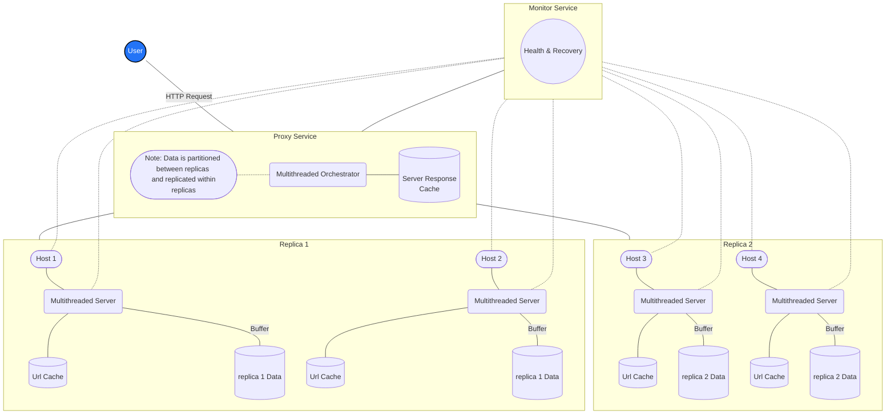
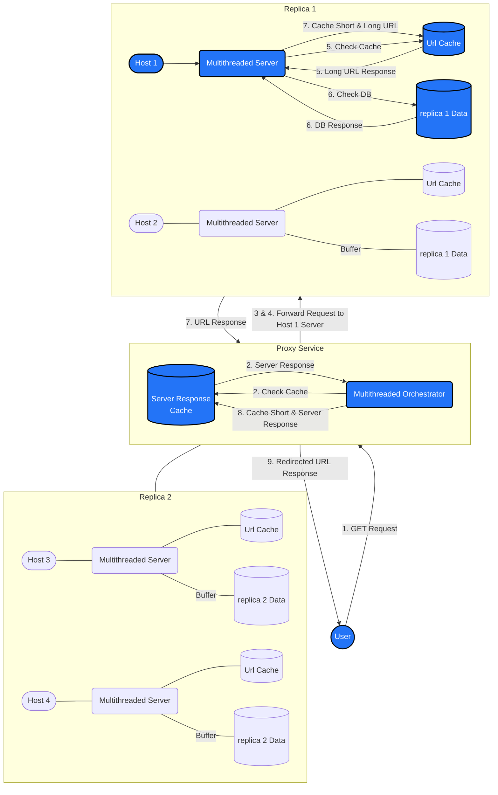
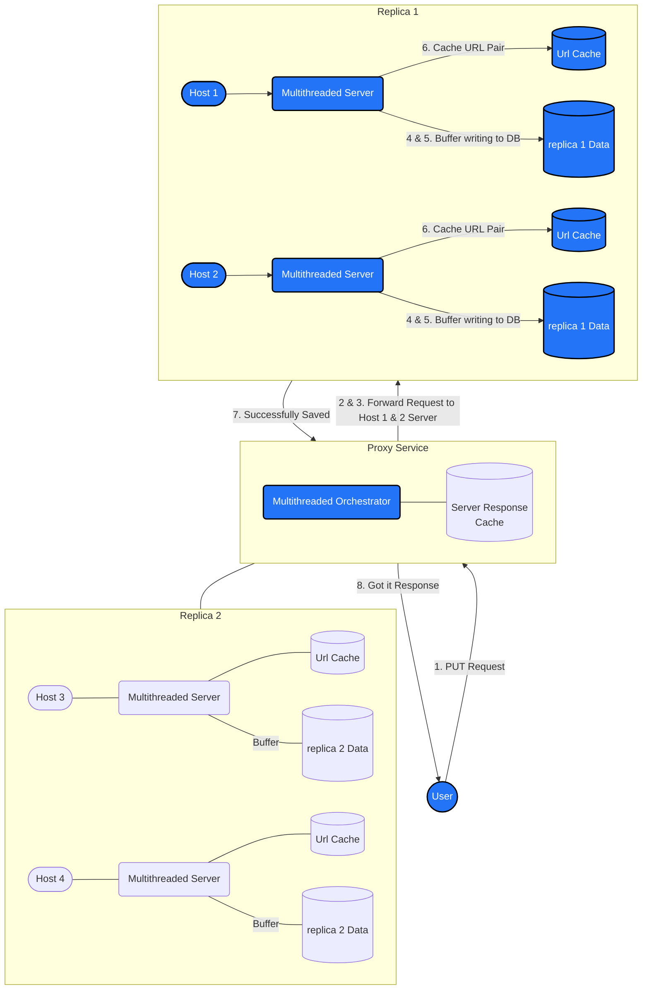
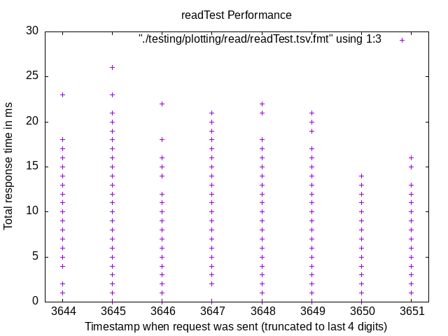
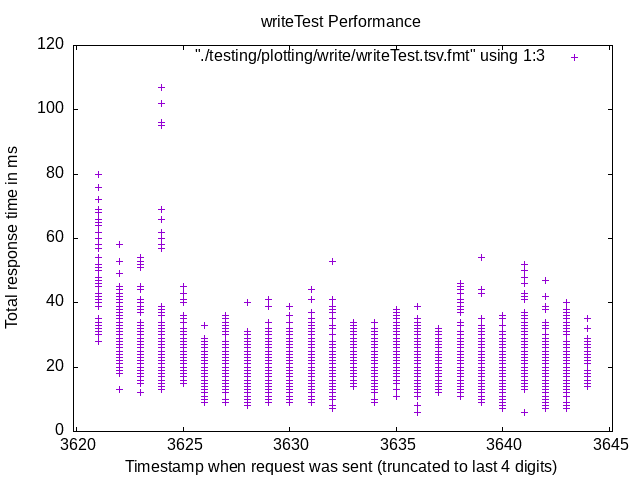

# Redirect

> A lightweight scalable URL Shortener system



The following mermaid diagram architecturally describes the system, view in a markdown viewer that supports mermaid diagrams such as GitHub.

## Table of Contents

- [Architecture](#architecture)
  - [Components](#components)
    - [GET Data Flow](#get-data-flow)
    - [PUT Data Flow](#put-data-flow)
  - [Code Overview](#code-overview)
- [Running The System](#running-the-system)
  - [Initial Setup](#initial-setup)
  - [Configuration](#configuration)
  - [Usage](#usage)
  - [Scaling Up](#scaling-up)
  - [Scaling Down](#scaling-down)
- [Testing The System](#testing-the-system)
  - [Performance Testing](#performance-testing)
    - [Read Test](#read-test)
    - [Write Test](#write-test)
  - [Correctness Testing](#correctness-testing)
- [Analysis](#analysis)
  - [Load Balancing](#load-balancing)
  - [Caching](#caching)
  - [Scalability](#scalability)
  - [Latency](#latency)
  - [Throughput](#throughput)
  - [Availability](#availability)
  - [Durability](#durability)
  - [Health Check](#health-check)

## Architecture

### Components

The system structure is composed of the following components:

- **Proxy**: The proxy service is responsible for receiving HTTP requests from the user and forwarding them to the appropriate server(s). It will load balance the requests between the servers with the orchestrator. It will also cache the responses from the servers to reduce the load on the servers. The proxy is multithreaded and will handle requests concurrently.

- **Orchestrator**: The orchestrator is responsible for managing the groupings of hosts to replicas, along with the load balancing of the requests between the replicas and servers. The strategy used for load balancing is consistent hashing (ring pattern), so the hashing will stay consistent if the number of hosts scale up. By default, the orchestrator will hash the short url to a replica of 2 hosts.

- **Replica**: The replica is an abstraction of a group of hosts and servers. Data is partitioned between the replicas and replicated within the replicas. This way, if a host or server fails, the data will still be available on another host within the replica. Replica groupings are different for every hash key, and each replica size is configurable, defaulting to 2 hosts. The replica size can be adjusted to increase the replication factor. This way, if a host or server fails, the data will still be available on another host within the replica.

- **Host**: The host is responsible for running the server and storing the data. They are multithreaded and will handle requests concurrently. For writes, the server writes to a buffer to minimize the write to the database. For reads, the server will first check the cache for the key value pair of short and long url respectively before checking the database.

- **Monitor**: The monitor service is responsible for monitoring the health of the system. It will check on the health of all hosts and servers every 5 seconds by default. If a host or server is down, it will recover by spawning a new host within the same replica as the failed host for each hash. It will also notify the orchestrator of the new host so that it can be used in replacement of the failed node.

#### GET Data Flow

1. User sends a GET request to the proxy with a short url.
2. The proxy will check the cache for the short url and returns the server response if found.
3. The proxy selects a replica to use for the request by hashing the short url.
4. The proxy forwards the request to a host and will retry until a response is received on a different host in the replica if the host is unreachable.
5. The host server will check its own cache for the short url and returns the long url if found.
6. The host server will check the database for the short url and returns the long url if found.
7. The host server will cache the short and long url pair and return the url to the proxy.
8. The proxy will cache the short and server response pair.
9. The proxy will return the server response to the user.



The following mermaid diagram the GET Request Data Flow in blue, view in a markdown viewer that supports mermaid diagrams such as GitHub.

#### PUT Data Flow

1. User sends a PUT request to the proxy with a short and long url.
2. The proxy selects a replica to use for the request by hashing the short url.
3. The proxy will forward the request to all hosts in the replica.
4. The host server will write the short and long url pair to their own buffers.
5. The host server buffer will flush to the database when it reaches a certain size / time limit.
6. The host server will cache the short and long url pair.
7. The host server will notify the proxy that the write was successful.
8. The proxy will return a success response to the user.



The following mermaid diagram the PUT Request Data Flow in blue, view in a markdown viewer that supports mermaid diagrams such as GitHub.

### Code Overview

The system code is organized into the following directories:

- **orchestration**: The orchestration directory contains the scripts for the proxy, orchestrator, and monitor services. It will handle the orchestration of the system along with the recovery of the system.

- **server**: The server directory contains the code for the server. It will handle the requests from the proxy and respond with the appropriate response along with writing to the database.

- **storage**: The storage directory contains the code and drivers to setup the database. It will handle optionally populating the database with data when setting up the system.

## Running The System

### Initial Setup

On the system, fix the `~/.bashrc` file to include the following:

```bash
export JAVA_HOME="/opt/jdk-20.0.1"
export PATH="/opt/jdk-20.0.1/bin:$PATH"
```

Run the `confirmAllHosts.bash` script to accept new ssh connections from the hosts so that there are no prompts when running the system.

```bash
./confirmAllHosts.bash
```

Run the following command from the root folder to build the system:

```bash
./make.bash
```

### Configuration

The system will initially use the hosts in the `HOSTS` file on the port found in the `PORT` file.

Server configurations can be adjusted in `orchestration/runServerLocal.bash`. The configurations are as follows:

- `IS_VERBOSE`: toggle log statements
- `HOSTPORT`: port which the server runs on
- `CACHE_SIZE`: size of cache used to store URLs obtained from GET and PUT requests
- `NUM_THREADS`: number of threads running in the server
- `WRITE_BUFFER_SIZE`: size of write buffer, which contains results from PUT client requests is periodically flushed to the database
- `SLEEP_DURATION`: interval to check for write buffer flushing

Proxy configurations can be adjusted in `orchestration/proxy/runProxyLocal.bash`. The configurations are as follows:

- `IS_VERBOSE`: toggle log statements
- `PROXYPORT`: port which the proxy runs on
- `CACHE_SIZE`: size of cache used to store server responses
- `NUM_THREADS`: number of threads running in the server
- `REPLICATION_FACTOR`: number of hosts to replicate data to

### Usage

Run the following command from the root folder to run the system:

```bash
./dostuff.bash
```

Once the system is running, the following commands can be used to interact with the system:

```bash
Sample PUT:
curl -X PUT "http://localhost:{PROXYPORT}?short=arnold&long=http://google.com"

Sample GET:
curl "http://localhost:{PROXYPORT}/arnold"
```

### Scaling Up

If we want to add a host to the system while its running, we can run the following command:

```bash
./orchestration/addHost.bash
```

We can optionally pass in arguments to the script, where the first argument is a host we want to replace, and the second argument is the host we want to clone data from.

### Scaling Down

If we want to remove a host from the system, we can run the following command:

```bash
./orchestration/removeHost.bash
```

We can optionally pass in an argument to the script, where the argument is the host we want to remove.

## Testing The System

### Performance Testing

For performance testing, we used `ab (apache benchmark)`. Our usage of this tool was very simple as it was just a load test.

We can run the following command to run the performance test after starting the system:

```bash
./testing/plotting/plotAll.bash
```

#### Read Test



From the read test, we can see that the system averages about 20ms for a read request.

The following table contains the timing results of sending 4000 read requests to the proxy.
|Host count|Time to complete all requests|
|--|--|
|1|6.045 seconds|
|2|5.255 seconds|
|3|4.849 seconds|
|4|4.532 seconds|

#### Write Test



From the write test, we can see that the system averages about 50ms for a write request.

The following table contains the timing results of sending 4000 write requests to the proxy.
|Host count|Time to complete all requests|
|--|--|
|1|12.812 seconds|
|2|11.255 seconds|
|3|15.008 seconds|
|4|14.605 seconds|

### Correctness Testing

For correctness tests, we used `curl` to send requests and bash to validate the responses automatically.

We can run the following command to run the correctness test after starting the system:

```bash
$ ./testing/correctness/correctTest.bash
All tests passed!
```

## Analysis

### Load Balancing

The proxy utilizes consistent hashing to load balance. The hash space is partitioned into 360 slots, with each server claiming 3 slots. Short URLs retrieved from requests are hashed. The data is replicated across two servers that are placed after the hash. Writes will go to both servers. Reads will select from one of the available servers and use the other if one is not available.

## Caching

Caches exist for both the proxy and server. The proxy cache maps URLs to responses sent by the servers, so they can be returned without having to contact the server again. This reduces the amount of time communicating over the network, which can be a significant bottleneck.

he server cache stores short and long URLs to avoid creating another database connection. This is also a significant bottleneck (IO).

### Scalability

#### Horizontal Scalability

The system is highly scalable as increasing the number of hosts and servers will increase the capacity of the system. The durability of the system will increase since the data is partitioned on more hosts and servers so there will be less data loss on a host or server failure. The system will also scale up and down dynamically. If we want to add a host to the system while its running, we can run the `./orchestration/addHost.bash` script. We can optionally pass in arguments to the script, where the first argument is a host we want to replace, and the second argument is the host we want to clone data from. If we want to remove a host from the system, we can run the `./orchestration/removeHost.bash` script. We can optionally pass in an argument to the script, where the argument is the host we want to remove.

#### Vertical Scalability

The application is capable of scaling with processing power and memory through configurations. Thread size can be adjusted to take advantage of the number and speed of available processors. Cache and write buffer size can be increased if necessary.

### Latency

The read latency of the application is 7.9 ms. The write latency of the application is 19.7 ms.

### Throughput

The read throughput is 504 requests / second. The write throughput is 203 requests / second.

### Availability

The system is highly available as it is replicated within the replicas. If a host or server fails, the data will still be available on another host within the replica. If a host is unresponsive, the proxy will retry the request on another host within the replica. The system will also recover from failures by spawning a new host within the same replica as the failed host for each hash. It will also notify the orchestrator of the new host so that it can be used in replacement of the failed node. This is a result of the ring pattern (consistent hashing) used for load balancing and data partitioning. On the first host failure, no data will be lost as all of its data is partitioned throughout the system in various replicas. On a second host failure, minimal data will be lost since the data is partitioned and replicated within the replicas.

### Durability

The durability of the system is strong since each url pairing will be replicated on each replica (with a default of 2 hosts). Since each replica is unique for each hash, data is partitioned throughout the entire system of nodes but not replicated on each host. This means that if a host go down (first host failure), no data will be lost.

### Health Check

The application periodically pings each host and the status of the server on each host. If a node goes down, the system will spawn another node and start the process within 5 seconds. While the service is down, requests to other nodes still operate as normal.
